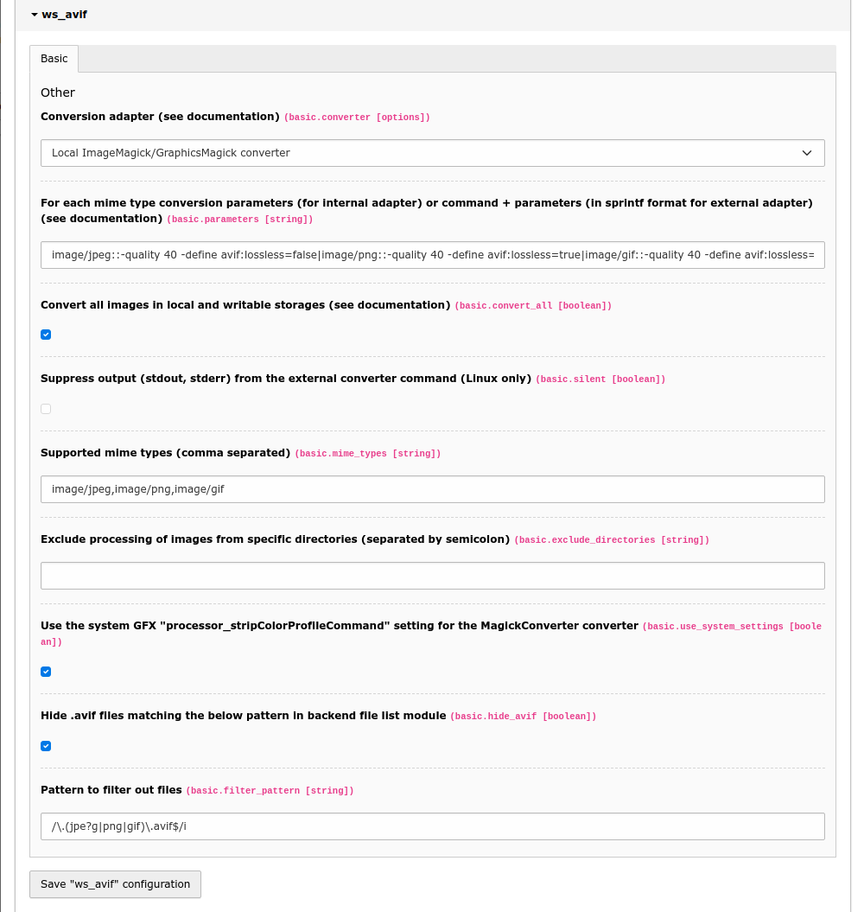
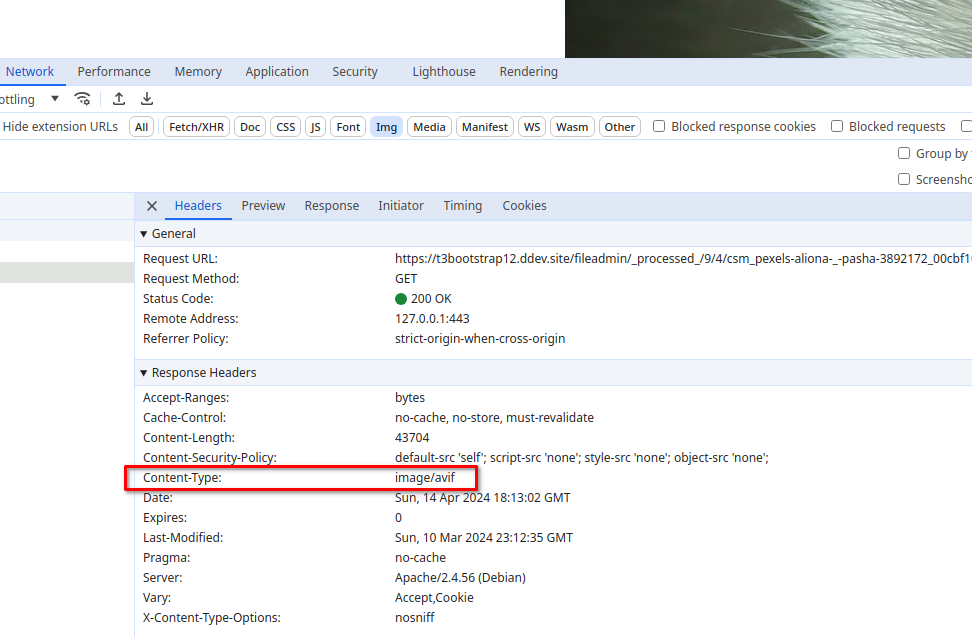

# Avif for TYPO3 CMS

## What does it do?

Adds an automagically created _Avif_ copy for every processed jpg/jpeg/png/gif image in the format

    original.ext.avif
    
## What is Avif and why do I want it?

> AV1 Image File Format (AVIF) is an open, royalty-free image file format specification for storing images or image sequences compressed with AV1 in the HEIF container format.[1][2] It competes with HEIC, which uses the same container format built upon ISOBMFF, but HEVC for compression. Version 1.0.0 of the AVIF specification was finalized in February 2019.

> In a number of tests by Netflix in 2020, AVIF showed better compression efficiency than JPEG as well as better detail preservation, fewer blocking artifacts and less color bleeding around hard edges in composites of natural images, text, and graphics


## Installation

Add via composer: 

    composer require "wapplersystems/avif"

* Install and activate the extension in the Extension manager 
* Flush TYPO3 and PHP Cache
* Clear the processed files in the Install Tool or Maintenance module
* Add rewrite rules for your webserver (see examples for Apache and nginx below)

## Update

* Save the extension settings at least once (through `Admin Tools > Settings > Extension Configuration > ws_avif`) after an update to save the new default settings in your local configuration

## Requirements

You can either use the installed Imagemagick or GraphicsMagick you already use for TYPO3 image manipulation if it supports avif (see below) or you can use any other external binary available on your server (e.g. [_cavif_](https://developers.google.com/speed/avif/docs/cavif)).

You can test the support of GraphicsMagick with e.g.:

    gm version | grep Avif

(should return `yes`)

or using ImageMagick with e.g.: 

    convert version | grep avif

(should return a list of supported formats including `avif`)

These are examples, check your system documentation for further information on how to verify avif support on your platform.

## Extension settings



You can set parameters for the conversion in the extension configuration. 

### `parameters`

```
parameters = image/jpeg:-quality 40 -define avif:lossless=false|image/png:-quality 40 -define avif:lossless=true|image/gif::-quality 40 -define avif:lossless=true
```

You find a list of possible options here:

http://www.graphicsmagick.org/GraphicsMagick.html

If you want to use an external binary, you have to supply an option string with exactly two `%s` placeholders for the original file and the target file name.
E.g.:

```
image/jpeg::/usr/bin/cavif -jpeg_like %s -o %s|image/png::/usr/bin/cavif -lossless %s -o %s|image/gif::/usr/bin/gif2avif %s -o %s
```

https://developers.google.com/speed/avif/docs/cavif

*Warning*

Try to set a higher value for `quality` first if the image does not fit your expectations,
before trying to use `avif:lossless=true`, as this could even lead to a
higher filesize than the original!

### `convert_all`

    # cat=basic; type=boolean; label=Convert all images in local and writable storage and save a copy in Avif format; disable to convert images in the _processed_ folder only
    convert_all = 1
    
Since version `1.1.0` all images in every local and writable storage will be saved as a copy in Avif format by default (instead of just images modified by TYPO3 in the storage's processed folder). If you want to revert to the previous behaviour, set this flag to `false` (disable the checkbox).

### `silent`

    # cat=basic; type=boolean; label=Suppress output (stdout, stderr) from the external converter command
    silent = 1
    
Since version `2.2.0` you can suppress output (stdout, stderr) from the external converter (Linux only).

### `hide_avif`

    # cat=basic; type=boolean; label=Hide .avif files in backend file list module
    hide_avif = 1

`.avif` files are hidden by default in the backend file list module. If you want to show them to the users, disable this option.

If you need a more customized behaviour for hiding or showing the generated files (e.g. for a specific BE user group),
you can always remove or change the `$GLOBALS['TYPO3_CONF_VARS']['SYS']['fal']['defaultFilterCallbacks']` settings
(see `ext_localconf.php` for details) in your own extension.

### `exclude_directories`

    # cat=basic; type=string; label=Exclude processing of images from specific directories (separated by semicolon)
    exclude_directories =

Here you can exclude processing of images from specific directories.
Example value: `/fileadmin/demo/special;/another-storage/demo/exclusive`

### `use_system_settings`

    # cat=basic; type=boolean; label=Use the system GFX "processor_stripColorProfileCommand" setting for the MagickConverter converter
    use_system_settings = 1

When set (default) the value from `$GLOBALS['TYPO3_CONF_VARS']['GFX']['processor_stripColorProfileCommand']` is appended 
automatically to the configuration options for the `MagickConverter` converter, so you don't need to repeat the settings.

## Webserver example configuration

Please **adapt** the following to _your specific needs_, this is **only an example** configuration.

### nginx

Add a map directive in your global nginx configuration:

    map $http_accept $avif_suffix {
        default   "";
        "~*avif"  ".avif";
    }

If you use _Cloudflare_ the following might better suit your needs:

    map $http_accept $avifok {
        default   0;
        "~*avif"  1;
    }

    map $http_cf_cache_status $iscf {
        default   1;
        ""        0;
    }

    map $avifok$iscf $avif_suffix {
        11          "";
        10          ".avif";
        01          "";
        00          "";
    }

Add these rules to your `server` configuration:

    location ~* ^.+\.(png|gif|jpe?g)$ {
            add_header Vary "Accept";
            add_header Cache-Control "public, no-transform";
            try_files $uri$avif_suffix $uri =404;
    }

Make sure that there are no other rules that prevent further rules or already apply to the specified image formats and prevent further execution!

You can also add a browser restriction if your audience uses old versions of Safari, etc., so no _avif_ is served to them.

    location ~* ^.+\.(png|gif|jpe?g)$ {
        if ($http_user_agent !~* (Chrome|Firefox|Edge)) {
            set $avif_suffix "";
        }
        …

### Apache (.htaccess example)

We assume that module `mod_rewrite.c` is enabled.

    RewriteEngine On
    AddType image/avif .avif

is already part of the TYPO3 htaccess template in
`typo3/sysext/install/Resources/Private/FolderStructureTemplateFiles/root-htaccess`

    RewriteCond %{HTTP_ACCEPT} image/avif
    RewriteCond %{REQUEST_FILENAME} (.*)\.(png|gif|jpe?g)$
    RewriteCond %{REQUEST_FILENAME}\.avif -f
    RewriteRule ^ %{REQUEST_FILENAME}\.avif [L,T=image/avif]

    <IfModule mod_headers.c>
        <FilesMatch "\.(png|gif|jpe?g)$">
            Header append Vary Accept
        </FilesMatch>
    </IfModule>

Make sure that there are no other rules that prevent further rules or already apply to the specified image formats and prevent further execution!

You can also add a browser restriction if your audience uses old versions of Safari, etc., so no _avif_ is served to them.

    RewriteCond %{HTTP_ACCEPT} image/avif
    RewriteCond %{HTTP_USER_AGENT} ^.*(Chrome|Firefox|Edge).*$ [NC]
    …

## Verify successful avif image generation and delivery

To make sure that everything works as expected you need to check two things:

1. Avif image generation on the webserver
2. successful delivery of Avif images to the client

### Avif image generation

Go to `fileadmin/_processed_` and check the subfolders for files with `.avif` extension. For every processed image file there should be a second file with the same filename plus `.avif` extension:

```
csm_foo-bar_4f3d6bb7d0.jpg
csm_foo-bar_4f3d6bb7d0.jpg.avif
```

### Delivery of Avif images to the client

Open a processed jpg or png image (see above) in your browser, e.g. `https://domain.tld/fileadmin/_processed_/b/2/csm_foo-bar_4f3d6bb7d0.jpg`

Check the response headers in the developer tools of your browser. Despite the file suffix `.jpg`, you should get `Content-Type: image/avif`.



## Troubleshooting and logging

If something does not work as expected take a look at the log file.
Every problem is logged to the TYPO3 log (since version 2.0), normally found in `var/log/typo3_*.log`

Converted files that are larger than the original are removed automatically (since version 2.1.0)
and the conversion will not be retried with the same configuration.

If you find that your avif images don't look like the original images (much darker, for example), make sure you have the correct profile set in the system setting `GFX/processor_colorspace` (e.g. `sRGB`). Remember to clean up any processed files after this change.

## Removing processed files

You can remove the created .avif files at any time within the TYPO3 CMS backend.

* Go to Admin Tools > Remove Temporary Assets
* Click the _Scan temporary files_ button
* In the modal click the button with the path of the storage

Although the button names only the path of the `_processed_` folder, all processed files of the storage are actually deleted!

## Drawbacks to keep in mind

Note that this extension produces an additional load on your server (each processed image is reprocessed) and possibly creates a lot of additional files that consume disk space (size varies depending on your! configuration).

## Inspiration

This extension is a modified version of the [webp](<https://extensions.typo3.org/extension/webp/>) extension.


